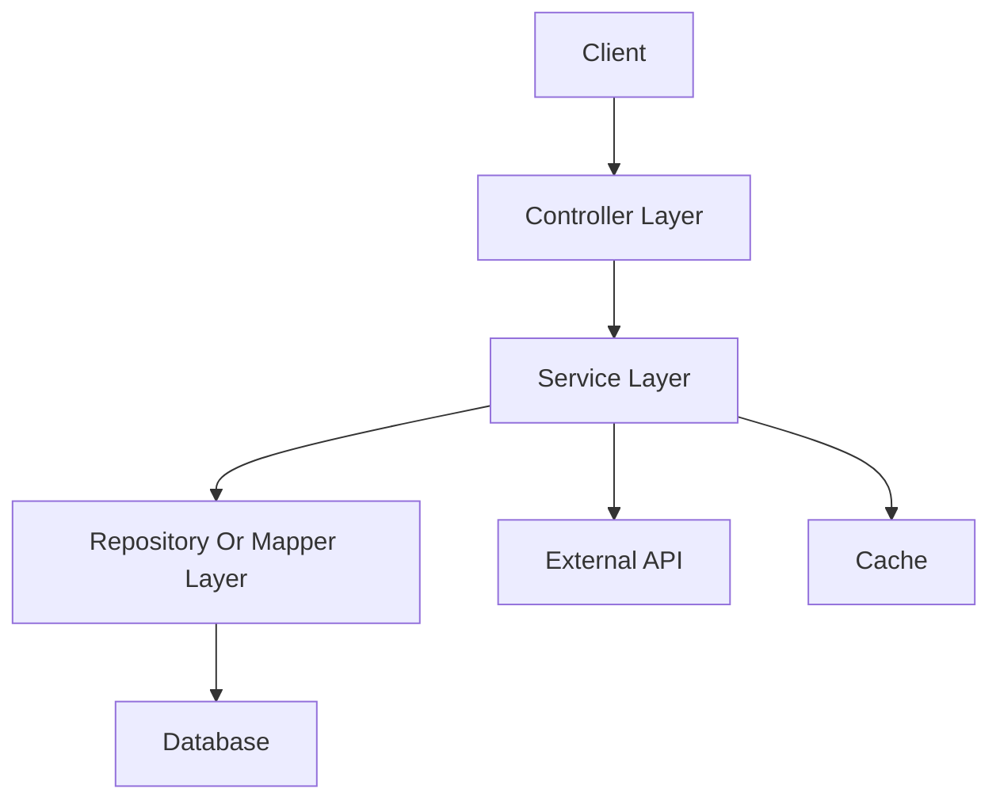

# [项目名] 项目分析报告

## 1. 项目概览

### 1.1 项目定位

[说明项目解决什么问题、服务哪些用户或业务流程。]

### 1.2 项目结构

[说明 Maven/Gradle 模块、源码目录、资源目录、测试目录。]

### 1.3 启动方式

[说明启动类、容器、部署形态、运行入口。]

### 1.4 技术栈

[列出 Java 版本、Spring Boot/Spring MVC、ORM、中间件、HTTP/RPC、任务调度、日志、监控等。]

## 2. 架构分析

### 2.1 整体架构



### 2.2 分层结构

- Controller 层：[职责]
- Service 层：[职责]
- Repository/Mapper 层：[职责]
- Common/Util 层：[职责]
- Config 层：[职责]
- Job/Scheduler 层：[职责]

### 2.3 依赖方向

[说明模块之间的依赖方向，标注不合理的反向依赖或循环依赖。]

### 2.4 外部系统

- 数据库：
- 缓存：
- 消息队列：
- HTTP/RPC：
- 配置中心：
- 定时任务：
- 鉴权/网关：

## 3. 功能梳理

### 3.1 [功能模块 A]

- 入口：
- 核心服务：
- 数据对象：
- 外部依赖：
- 说明：

### 3.2 [功能模块 B]

- 入口：
- 核心服务：
- 数据对象：
- 外部依赖：
- 说明：

## 4. 入口全量导览（Controller + XXL-Job + Scheduled）

> 本章用于“入口导航”和“功能点全貌”，不展开逐入口的流程图与细节拆解。逐入口的流程图、调用链、功能点实现逻辑与关键变量用途统一放在入口手册：[`PROJECT_ENTRYPOINT_GUIDE.md`](./PROJECT_ENTRYPOINT_GUIDE.md)。

### 4.1 入口统计（数量）

- Controller（HTTP）入口：`[数量]` 个
- XXL-Job 入口：`[数量]` 个
- Scheduled 入口：`[数量]` 个
- 其它入口（如消息/ RPC / 回调）：`[数量]` 个（如适用）

### 4.2 整体描述（按功能点/业务域）

- 功能域 A（如订单/支付/内容/权限）：入口覆盖范围、主要模块、典型链路一句话描述
- 功能域 B：同上

### 4.3 入口索引（可跳转到入口手册）

> 规则：这里只做索引，不画每个入口的 Mermaid 图，不逐入口拆解变量与实现逻辑。

#### Controller（HTTP）

- `[ControllerName]`
  - `GET /path` → `Controller.method` → [详解](./PROJECT_ENTRYPOINT_GUIDE.md#[anchor])
  - `POST /path` → `Controller.method` → [详解](./PROJECT_ENTRYPOINT_GUIDE.md#[anchor])

#### XXL-Job

- `[JobClass]`
  - `@XxlJob("handlerName")` → `JobClass.method` → [详解](./PROJECT_ENTRYPOINT_GUIDE.md#[anchor])

#### Scheduled

- `[SchedulerClass]`
  - `@Scheduled(cron="...")` → `SchedulerClass.method` → [详解](./PROJECT_ENTRYPOINT_GUIDE.md#[anchor])

## 5. 关键数据模型

### 6.1 [DTO/VO/Entity 名称]

- 字段：
- 来源：
- 去向：
- 重要状态：

## 6. 配置梳理

### 7.1 本地配置

- `application.yml`：
- `application-*.yml`：
- XML/SQL：

### 7.2 运行所需关键配置

- 配置项：
- 来源：
- 用途：

## 7. 风险点与维护建议

本章只保留项目级风险摘要。每条链路的异常场景、日志线索和排查步骤应抽离到 `PROJECT_EXCEPTION_PLAYBOOK.md`。

### 8.1 [风险标题]

[说明风险、影响、建议。]

### 8.2 [风险标题]

[说明风险、影响、建议。]

## 8. 异常集与故障分析手册

默认单独生成文件：

`PROJECT_EXCEPTION_PLAYBOOK.md`

异常手册结构：

```markdown
# [项目名] 异常集与故障分析手册

## 1. 异常总览
- 异常分类
- 高风险链路
- 关键外部依赖
- 排查优先级

## 2. 按链路整理异常

### 2.1 [链路名]

#### 异常场景：[场景名]
- 触发条件：
- 表现现象：
- 可能原因：
- 影响范围：
- 代码逻辑视角：
  - 异常来源：
  - 外部调用：
  - 事务/异步/重试/降级：
- 运行时数据视角：
  - 必填变量：
  - 合法取值：
  - 缺失/错误变量示例：
  - 数据格式要求：
  - 操作顺序：
  - 数据前置条件：
  - 用户/权限/状态要求：
- 关键变量和状态依赖：
- 日志线索：
- 排查步骤：
- 临时处理：
- 长期修复建议：

## 3. 通用排查索引
- 按错误现象查：
- 按日志关键词查：
- 按接口路径查：
- 按 Job/任务名查：
- 按关键变量查：
- 按必填变量/合法取值查：
- 按业务前置条件查：
- 按外部依赖查：
```

## 9. 新人阅读路径

1. [先读什么]
2. [再读什么]
3. [最后读什么]

## 10. 总结

[用简短文字总结项目核心价值、核心链路和后续优先改进项。]
