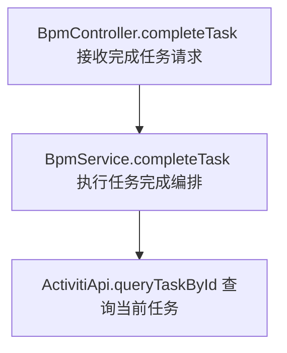

# Java 项目分析报告工作流

## 目标

把“拿到一个 Java 项目后生成项目理解报告”的操作固定下来。后续只要提供项目路径，就可以按统一流程输出：

- 项目整体理解报告
- Controller 接口全量导览
- 每个 Controller 接口的流程图或逻辑图
- 每个 Controller 接口的功能点主要实现逻辑和变量用途
- 独立异常集与故障分析手册
- 模块与外部依赖梳理
- 风险点与新人阅读路径

本工作流与报告模板由 **Logic-Code** IntelliJ 插件随包提供（仓库内位于项目根目录 `java/`）。

若要在**被分析的项目**里覆盖默认内容，可在该项目根目录创建 `java/`，放入同名文件：

- `JAVA_PROJECT_REPORT_WORKFLOW.md`
- `JAVA_PROJECT_REPORT_TEMPLATE.md`

插件会优先读取项目内的上述文件，再回退到内置副本。

## 推荐输入

最少只需要提供：

```text
项目路径：/path/to/java/project
```

如果希望报告更精准，可以补充：

- 重点关注模块
- 重点 Controller 或接口
- 是否需要 Canvas 可视化概览
- 报告输出路径
- 是否允许运行测试或构建命令

## 固定分析流程

### 1. 项目识别

读取并判断：

- `pom.xml`
- `build.gradle`
- `settings.gradle`
- `README`
- `src/main/java`
- `src/main/resources`
- 启动类
- 配置文件

输出：

- 项目类型
- Java 版本
- Maven/Gradle 模块结构
- 运行方式
- 主要依赖

### 2. 模块与架构梳理

识别：

- `web` / `controller`
- `biz` / `service`
- `common` / `util`
- `client`
- `mapper` / `repository`
- `config`
- `scheduler` / `job`
- `model` / `dto` / `vo` / `entity`

输出：

- 模块职责
- 依赖方向
- 分层结构
- 外部系统

### 3. 入口提取（Controller + XXL-Job + Scheduled）

搜索：

- `@RestController`
- `@Controller`
- `@RequestMapping`
- `@GetMapping`
- `@PostMapping`
- `@PutMapping`
- `@DeleteMapping`
- `@PatchMapping`
- `@XxlJob`
- `@Scheduled`

输出：

- 入口类型（HTTP Controller / XXL-Job / Scheduled）
- 入口类与方法（类.方法）
- 触发元信息（HTTP method/path 或 handlerName/cron/fixedDelay 等；无法静态确认则写“静态分析无法确认”）
- 入参对象（HTTP 的 Path/Query/Body/Header；Job/Scheduled 的配置/上下文来源）
- 返回对象（HTTP 返回体；Job/Scheduled 通常为 void 或运行结果）
- 调用 Service/Client
- 每个入口的 Mermaid 流程图或逻辑图
- 每个入口的功能点主要实现逻辑
- 每个入口的关键变量用途

入口必须全量罗列：

- 不允许只列核心入口或示例入口。
- 每个带 `@RequestMapping`、`@GetMapping`、`@PostMapping`、`@PutMapping`、`@DeleteMapping`、`@PatchMapping` 的 Controller 方法都必须出现在 `PROJECT_ENTRYPOINT_GUIDE.md`（入口手册）中，并在主报告第 4 章以“索引”形式出现（可跳转链接）。
- 每个带 `@XxlJob` 的方法都必须出现在 `PROJECT_ENTRYPOINT_GUIDE.md` 中，并写清 handlerName（若在平台配置导致无法静态确认，则明确写“静态分析无法确认”）；主报告第 4 章必须包含其索引与统计。
- 每个带 `@Scheduled` 的方法都必须出现在 `PROJECT_ENTRYPOINT_GUIDE.md` 中，并写清 cron/fixedDelay/fixedRate（无法静态确认则写“静态分析无法确认”）；主报告第 4 章必须包含其索引与统计。
- 主报告第 4 章只做“入口导航”：
  - 按入口类型统计数量
  - 按功能点/业务域给整体描述
  - 按入口类型与类分组列出入口索引（类.方法 + 触发元信息），并提供跳转到 `PROJECT_ENTRYPOINT_GUIDE.md` 的链接与锚点
- `PROJECT_ENTRYPOINT_GUIDE.md` 才做逐入口详解（全量）：
  - 触发元信息（HTTP/handlerName/cron）
  - 入口方法
  - 入参/上下文来源
  - 返回/执行结果
  - 调用的 Service/Client
  - Mermaid 流程图或逻辑图：每个入口必须有图，节点采用“代码标识英文 + 说明中文”
  - 功能点主要实现逻辑：参数处理、默认值/格式化、校验/前置条件、核心调用、数据写入/外部副作用、返回与异常
  - 关键变量用途：来源、含义、用途、是否必填、合法取值、传递方向、缺失/错误表现
  - 入口类型：核心链路、普通入口、管理/配置入口、查询入口、回调/同步入口、调试/内部入口
- 第 5 章“主要链路分析”不再单独生成；逐入口图示、实现逻辑和变量用途只出现在 `PROJECT_ENTRYPOINT_GUIDE.md`。

每个接口导览固定使用以下结构：

```text
### [HTTP_METHOD] /path

- Controller 方法：
- 请求参数：
- 返回模型：
- 调用 Service/Client：
- 接口类型：

Mermaid 流程图或逻辑图：
- 每个接口必须有图
- 节点统一采用“代码标识英文 + 说明中文”
- 推荐格式：NodeId[ Class.method 中文动作说明 ]
- 短接口至少画出：接收请求 -> 参数处理 -> 核心调用 -> 返回结果

功能点主要实现逻辑：
1. 参数处理
2. 校验和前置条件
3. 核心业务调用
4. 数据读写或外部副作用
5. 返回与异常

关键变量用途：
- 变量名：来源、含义、用途、是否必填、合法取值、传递方向、缺失或错误时的表现
```

除 Controller 外，还要识别并单独分析这些入口：

- `@Scheduled`
- `@XxlJob`
- 消息消费者
- RPC provider 方法
- `main` 方法
- public Service 方法
- 批处理或同步任务入口

### 4. 图示生成

默认生成 Mermaid：

- 整体架构图
- 模块依赖图
- 每个 Controller 接口的流程图或逻辑图
- Job/RPC/消息入口也按接口导览规则生成逻辑图

流程图必须遵循统一节点风格：



### 5. 风险与建议

重点检查：

- 幂等性
- 事务一致性
- 异常处理
- 参数校验
- 鉴权与限流
- 明文 token/key
- 未闭合功能
- 未使用代码
- 重复创建/重复同步风险
- Mapper/Repository 与 DDL 是否匹配

### 6. 异常集与故障分析手册

从 Controller 接口导览中抽离异常场景，生成独立文档：

```text
PROJECT_EXCEPTION_PLAYBOOK.md
```

主报告的 `风险点与维护建议` 只保留项目级风险摘要，详细异常排查放在异常手册中。

每个异常场景固定记录：

- 触发条件
- 表现现象
- 可能原因
- 影响范围
- 代码逻辑视角：异常来自哪段代码、哪个外部调用、哪个事务/异步/重试/降级逻辑
- 运行时数据视角：哪些变量缺失、取值不合法、格式不匹配、状态不对或操作顺序错误
- 必填变量与合法取值
- 缺失/错误变量示例
- 操作顺序与数据前置条件
- 关键变量和状态依赖
- 日志线索
- 排查步骤
- 临时处理
- 长期修复建议

异常分析必须把两类问题合并在同一个异常场景中说明：

- 代码逻辑异常：代码抛错、外部调用失败、事务不一致、异步失败、异常被吞、重试失败。
- 运行时变量/业务前置条件异常：请求字段没填、变量格式错误、枚举/状态值不合法、没有先完成必要配置或前序操作、DB/ES/Redis/Activiti 中缺少必要状态、当前用户不具备该流程状态下的操作权限。

异常手册必须提供排查索引：

- 按错误现象查
- 按日志关键词查
- 按接口路径查
- 按 Job/任务名查
- 按关键变量查
- 按必填变量/合法取值查
- 按业务前置条件查
- 按外部依赖查

## 默认产出文件（Logic-Code 插件）

默认输出目录为 `<项目根>/docs/`（可在 **Settings → Tools → Logic Code Report → Output Directory** 修改）。典型结构：

```text
<project>/docs/prev/PROJECT_INVENTORY.md
<project>/docs/prev/PROJECT_SOURCE_CONTEXT.md
<project>/docs/prev/GENERATE_REPORT_PROMPT.md
<project>/docs/report/PROJECT_ANALYSIS_REPORT.md
<project>/docs/report/PROJECT_ENTRYPOINT_GUIDE.md
<project>/docs/report/PROJECT_EXCEPTION_PLAYBOOK.md
```

在 IDE 中打开 **LogicCodeReport** 工具窗口可预览 `docs/report/` 下的 Markdown，并触发「Generate Report」全流程。

## 报告模板

详见同目录下的：

`JAVA_PROJECT_REPORT_TEMPLATE.md`
